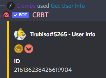
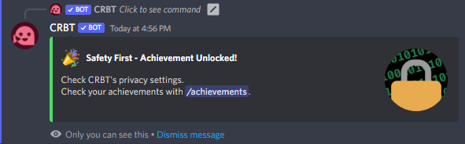
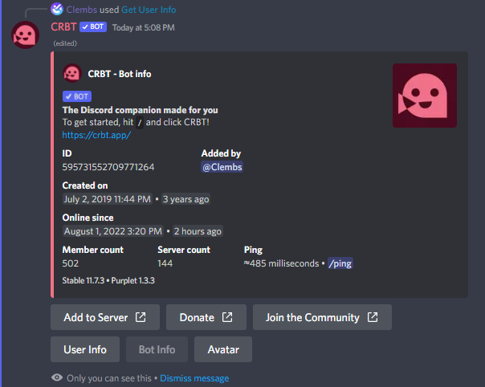
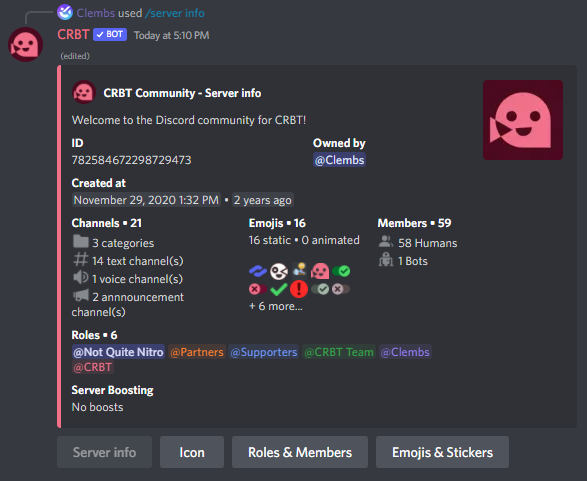
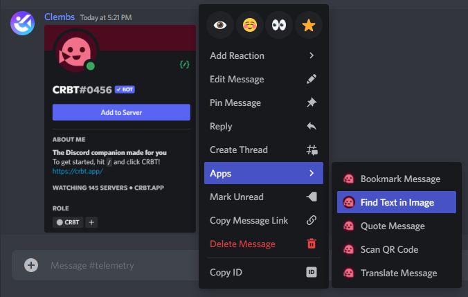
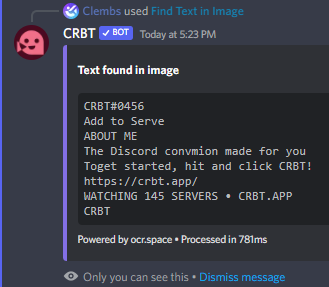
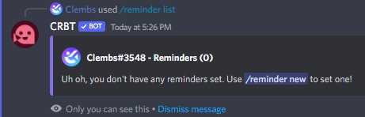

### Golden Purplet badge

Ahead of the new per-server Economy feature coming in the next months, a Golden Purplet badge has been given to those who participated in the earlier global CRBT economy from February to May. This badge will show alongside your Discord badges in the User Info sheet.

## Achievements

CRBT now supports a long-awaited feature: Achievements!

For doing certain actions in the bot like inviting it, bookmarking messages, etc. you will get unlock a CRBT achievement.

There is a total of 11 achievements for now, and we plan on adding more in the future! Some are hidden and you will need to dig deep to find them, tho.

You can always view your achievements, or someone else's, by using the `/achievements` command.

## Helpful new, and reworked features

### /bot info

To get info on a bot within a server, simply use the `/bot info` command.

Extra info will be displayed when used with CRBT as the target, like so:

As you can see, the bot info is also present in the bottom navigation of the User Info sheet.

### Server info navigation

[Just like the User Info sheet previously](../11.4-changelog.mdx), the Server Info sheet has been redesigned to look more clean and streamlined, and the new bottom navigation buttons will help you get more info than before, with a dedicated Roles list, Emojis list and extras!

### Find Text in Image

Sometimes you may want to find text within an image sent in Discord, to copy it, translate it, etc.

Whatever the case may be, most Optical Character Recognition online tools are fairly annoying to use, and while Google Lens works, it's a chore to use when you're just on your computer. And those solutions aren't even built-in on Discord!!

Hence why we had the brilliant idea to just integrate Optical Character Recognition to CRBT, and make it a message context menu command!

To use it, simply right click (or long press!) a message, choose "Apps" then "Find Text in Image":

Of course, while the results aren't always perfect in every language, it should get the job done most of the time.

### CRBT API

The CRBT API is now partially implemented, and you can get a token by [applying for one](https://forms.gle/EEiGYzNK8AM9kqw28).

The documentation is available [here](https://resources.crbt.app/docs/api/intro).

### Redeem CRBT tokens

You can redeem prizes from giveaways using compatible CRBT tokens, or use your registered API tokens using the new `/redeem` command.

Be on the lookout for giveaways in [the Discord server](https://crbt.app/discord), and on the [website](https://crbt.app).

## Minor additions & changes

- Changed some links to point to this new Resources website! Full changelog of that [here](../new-resources-website.mdx)
- Command mentions are here! Instead of just writing what commands to use when, there now is a nicer syntax to embed them in messages. If you ever come across one, simply click it to insert that command on your chat box.

- You can now quote a message in the current channel by right clicking (or long pressing) it, "Apps", then "Quote Message".
- Some commands are now restricted in DMs by default, and exceeding character length limits in certain commands will now warn you before using said commands.
- `/crbt info` was replaced with `/bot info`, and somewhat works the same way.
- CRBT is now very partially proposed in Polish, Hindi & Hungarian. If you know these languages well, suggest some translations [here](https://crowdin.com/project/crbt)!

## Fixed

- [Missing "Jump to Message" button in /quote](https://discord.com/channels/782584672298729473/843146449675747378/1002165030508310530)
- [Giveaways don't work at all](https://discord.com/channels/782584672298729473/843146449675747378/1000033023288422432)
- [Error when creating a Poll with an option that has an emoji, but no label](https://discord.com/channels/782584672298729473/843146449675747378/1000033023288422432)
- [Poll buttons losing sync or going missing after updating it](https://discord.com/channels/782584672298729473/843146449675747378/995336439141249154)
- [Being able to use /emoji info with a string _containing_ the emoji + other things](https://discord.com/channels/782584672298729473/843146449675747378/1000877544083566612)
- [Having a choice surpass 40 chars returns a default unresponding error](https://discord.com/channels/782584672298729473/843146449675747378/997140221198078024)
- [/avatar with a specified format always returns WEBP](https://discord.com/channels/782584672298729473/843146449675747378/995629478556487750)
- [Public reminders are snoozable by everyone](https://discord.com/channels/782584672298729473/843146449675747378/1003288741428858901)
- [Incorrect strings in /warn, showing duplicates of /timeout](https://discord.com/channels/782584672298729473/843146449675747378/1002000533235703868)

## Being Tested

These features are currently being tested, for either a later v11 release or for v12.

- Custom Commands
- Web Dashboard with Discord login
- Redeemable codes for CRBT Beta Access in `/redeem`
- Customizable per-server Economy, as detailed in this [blog post](../rethinking-crbt-profiles-economy.mdx)
- [Statcord](https://statcord.com) integration, with logs found [here](https://statcord.com/bot/595731552709771264)
- [Purplet v2 beta](https://crbt.app/purplet) is being rewritten as a bigger monorepo with Vite v3, and your tests and help are great appreciated! Repo can be found [here](https://crbt.app/github/Purplet).
- [CRBTscript v11](./docs/crbtscript/intro), with a completely rewritten engine allowing for way more powerful scripting capabilities, including functions, statements, larger dot access tags and faster execution times! Repo can be found [here](https://crbt.app/github/CRBTscript).
