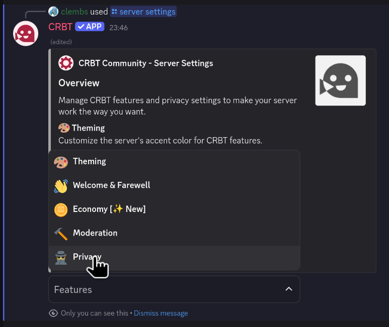
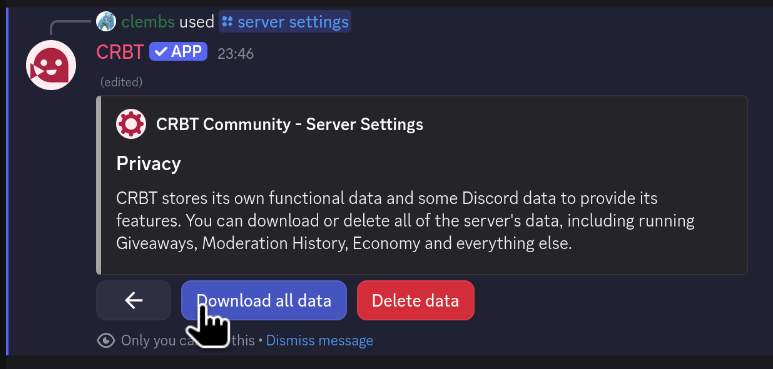
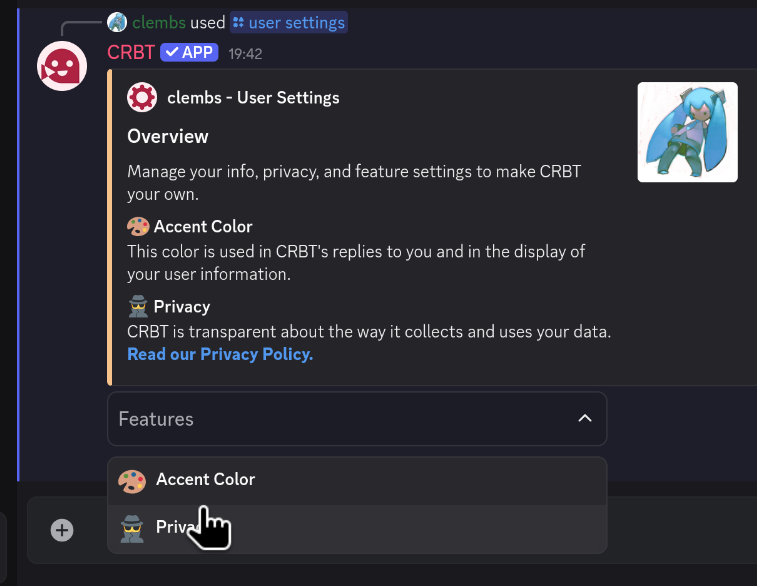

Hi everyone, I'm sorry to announce the sad news but I will be discontinuing development for CRBT on September 2025.

This was a tough decision to make, although it was predictable. CRBT's code base has not changed in almost a year, and growth has been stagnating for more time than that.

CRBT was started back in 2019 with the goal to provide all tools a Discord community admin could ever want. Every menu was carefully crafted to be very simple to use yet feature advanced controls. It was made, for free, at a time where competing options were all offering exhorbitant Premium fees and paywalling most of their features.

Nowadays, Discord has incorporated most of the featureset CRBT used to be king (onboarding, polls, reporting...) and overall, the Discord app market has grown much larger with quality offerings. Although CRBT is technically on 217 servers as the time of writing, most of them are test or archived servers, and CRBT only really logs around 7 command uses per month meaning it's practically unused.

It is also a personal choice to unattach my strings from Discord, as I've grown to dislike the platform. Discord is a data behemoth, a privacy-invasive platform shoving down ads, Nitro promotions, "[Orbs](https://discord.com/blog/discord-orbs)" and more monetization down user's throats. I'm moving as much as I can off Discord, or cutting ties, which includes CRBT.

All in all, I hope you will understand my decision to completely unfocus off CRBT.

## What does this mean?

Slowly until September 2025, I will be archiving CRBT Team's [open-source code repositories on GitHub](https://github.com/CRBT-Team). This means no more new features or bug fixes, but any seasoned developer that want to give CRBT another chance can fork the project and host their own version!

I will be privating the Discord community, and will stop giving support. The Crowdin page for localizing CRBT's features will also be shut down (thanks so much to people who took the time to localize 🙏). The CRBT.app website and blog will continue existance for a few more years for archival purposes.

What this does **not** mean is end of _life_; CRBT will continue to exist for as long as it can, albeit with some bugs and errors as time goes on and the platforms CRBT relies on evolve.

## I am an admin using CRBT

If you're an admin using CRBT as your main management app, you should find another competent Discord multipurpose app. [Sapphire](https://sapph.xyz/) and [Carl-bot](https://carl.gg) may be suitable options for you.

If you want to find your server's data, use the `/server settings` command, then select the Privacy menu in the features dropdown.

From this menu, choose "Download all data" and CRBT will send you a JSON file containing all of your server's data.

This file can be easily read through and contains data such as:

- Your Welcome & Farewell messages
- Your server's accent color
- Enabled features (such as Moderation Reports, Logs, Economy...)
- Moderation History
- Currently running Giveaways
- Economy settings

Backing this data up may depend on your management Discord app replacement, if permitted at all. You may instead need to reconfigure settings manually from your replacement app's settings. Check your Discord app's documentation for more information.

:::note
If you're experiencing troubles accessing your server's CRBT data, please contact me through the [CRBT Community](https://crbt.app/discord).
:::

## I want to backup my personal CRBT data

To backup your personal data (that is tied to your Discord account, rather than a server), the process is simple.

Open your User Settings using the `/user settings` command, then select the Privacy menu in the features dropdown.

From this menu, choose "Download all data" and CRBT will send you a JSON file containing all of your server's data.

This file can be easily read through and contains data such as:

- Your privacy preferences (Telemetry, silently joining/leaving servers...)
- All of your servers' member data (Economy items, EXP, Achievements...)
- Your reminders
- Your profile data and settings (Badges and Accent color)

:::note
If you're experiencing troubles accessing your CRBT data, please contact me through the [CRBT Community](https://crbt.app/discord).
:::

## So then, what are you all up to?

- [Clembs](https://clembs.com), founder & main developer:

  I'm currently working on [Webpals](https://webpals.me/clembs), a social media-esque platform where users can create profiles ([seems familiar?](/blog/11.3-changelog#profiles)) with plenty of customization options (think MySpace but modern, accessible and mobile-friendly!) I'm heading into my final year of college, working as freelance and try-harding work at a college club. It's a lot to manage, which is also a bit why I want to get CRBT out of my head :P

- [Chloe](https://paperclover.net), main developer of Purplet:

  I've been working on software professionally in the San Francisco bay area. My current job is web performance at an undisclosed company. I spend my free time working on my art project [paper clover](https://paperclover.net), where I have just released a new music video. Aside from publishing art on the site, I've been getting video playback and site foundations to be as high quality as possible. Feel free to ask a question on my [q&a page](https://paperclover.net).

- Trubiso, CRBTscript and bot developer:

  Since I last worked on anything CRBT-adjacent, I have been working on several music-related and software-related projects, but I'm very much not oriented towards Discord bot development or web dev as much as I was a couple years ago; in fact, I'm about to go into my first year of university. For a lack of a personal website, check out my [Bandcamp](https://trubiso.bandcamp.com) and my [GitHub](https://github.com/trubiso) to see what I'm up to, or ask me stuff on Discord (`trubiso`) :)

## Final thanks

CRBT has been running for 6 years now, going through rewrites, major updates, a verification badge, server hiccups, major bugs, philoshophical changes and more. It's what got me into programming, and it's been a huge part of my early developer life. Lots of people have gotten to know me as the CRBT guy back then, and some even helped with development. I want to take the time to acknowledge everyone that helped me get this far:

- [Chloe](https://paperclover.net) for making the large majority of [Purplet](https://purplet.crbt.app/), helping with early hosting and some donations.
- [Trubiso](https://trubiso.bandcamp.com) for some bot development, localization, helpful testing and cheering me up.
- [Jules](https://julesbernard.com) for donating, localizing, writing a blog post and helping with testing on his large server.
- [James](https://jameshuang.design) for donating through the bot's development.
- [Morgan](https://morganlabs.dev) for some bot development too (and localizing in British ☕).
- [Filip](https://filipkin.com/) for hosting CRBT way back with Club Hosting and introducing me to many cool people.
- [Username](https://user5522.vercel.app) for blogging, localizing and testing heavily as well
- Y0urD0ctor, navy, Sovencho, Mikhail, Karl, Sorizona, Armand, Harola, Luca, Kutomi, SonicQ, Carrot Farmer, Simon, Cyb, Delnyn, Dee Jeh, Leap and tomahto (whew) for supporting the project, localizing, making CRBT banner art, helping making decisions, and so on...

And thanks to everyone else that I did not mention for their tremendous work that transcended all barriers. As cheesy as this will sound, I am truly forever thankful for this journey, and I hope you will all be there for future adventures (and if not, that's fine!).
