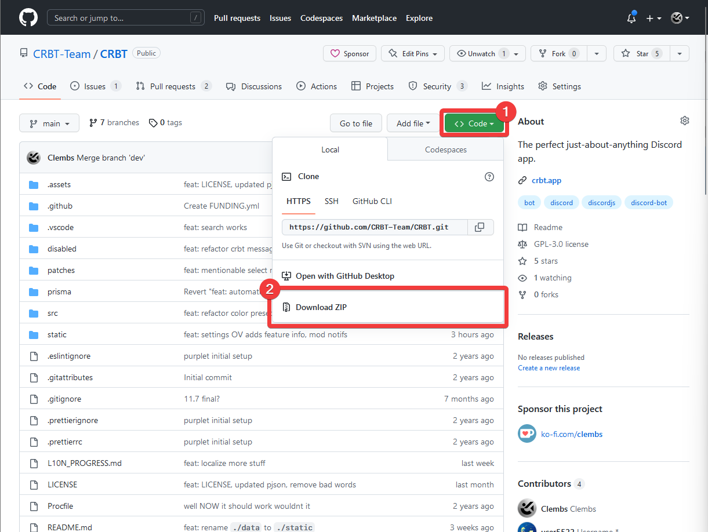
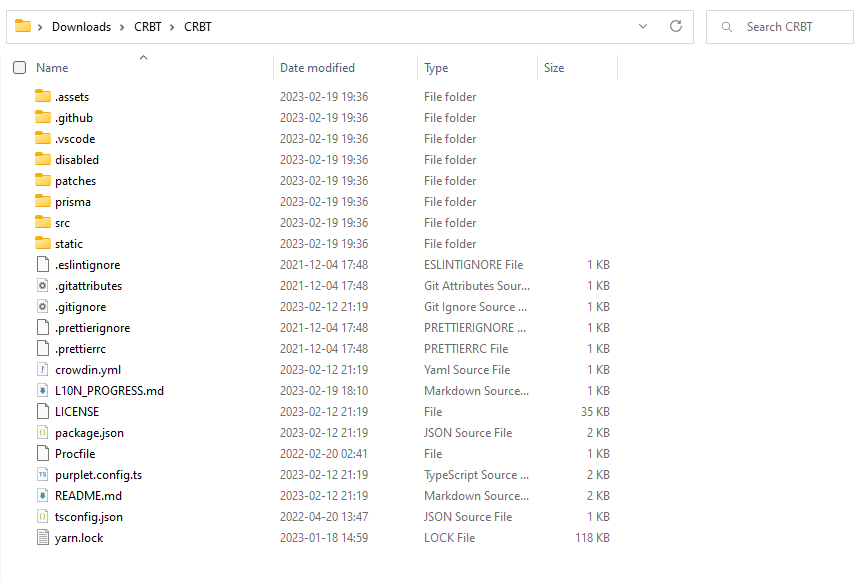
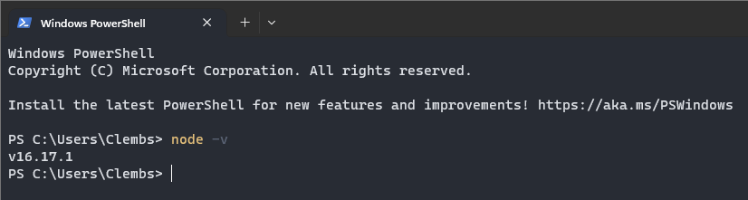
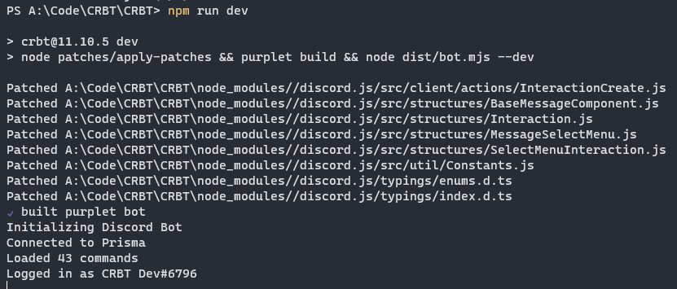
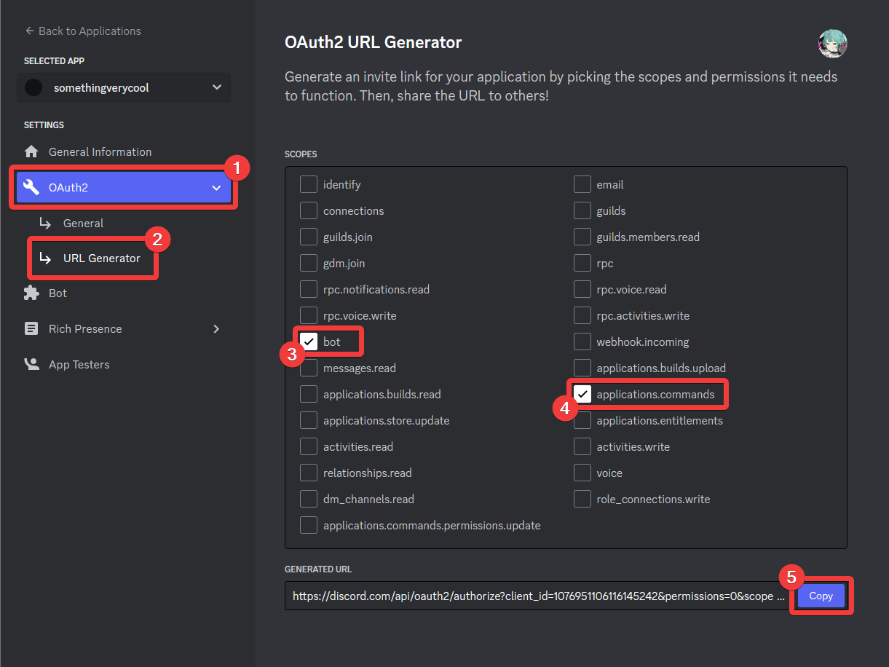
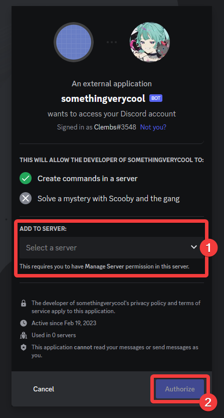

# A guide to self-hosting CRBT

:::caution
CRBT isn't fully ready to be self-hosted, with a few config variables missing and the CRBT branding being all over the place. Note that this guide isn't fully complete yet, but should be enough given some basic computer knowledge.
:::

Want to run your own instance of CRBT, under a different branding, with your own commands, or for another reason? This guide is for you!

## What is CRBT?

CRBT is the Discord app you need for server management, moderation, adding interactivity and fun to your server! You can learn more about it on [CRBT's website](https://crbt.app).

## Create your Discord bot

Detailed steps on how to create your Discord bot can be found in a [dedicated article](/self-hosting/create-bot).

1. Go to your [Discord Developer Portal](discord.com/developers/applications).
2. Click "New Application" on the top right hand corner.
3. Name it something, accept the Developer Policies and click "Create".
4. Navigate to the "Bot" tab and click "Add Bot".
5. Confirm with "Yes, do it!".
6. Copy your bot's token and store it somewhere safe like a [password manager](https://bitwarden.com).

## Install Node.js

CRBT is written in the web language JavaScript, but it isn't meant to be run on a web browser. Node.js is a desktop JavaScript runtime environment that lets us develop and build the bot.

To install it, head over to the [Node.js download page](https://nodejs.org/en/download/) and choose your OS.

:::note
Always prefer the latest LTS version of Node.js, unless you know what you're doing!
:::

## Clone CRBT

1. Download the source code from [CRBT's GitHub page](https://github.com/CRBT-Team/CRBT) by clicking on "Code" then "Download ZIP":
   

2. Extract the ZIP file in your file manager, then go inside of the newly created folder. Your folder should look like this:
   

## Set up a database

CRBT uses [Prisma](https://www.prisma.io/client to connect with a remote database, meaning you can set it up pretty much any SQL or MongoDB database.

It is a necessary component that you will need to set up for your bot to work properly.

If you don't know where to start, view how to quickly [set up a Supabase instance and configure it with CRBT](/self-hosting/database-setup).

## Add environment variables

1. Create a file named `.env` and open it with a text editor program, such as Notepad.
2. Paste in this [environment variables example](/self-hosting/env) and edit it according to the comments (lines starting with #):

```toml
# Paste the bot token you copied earlier in place of YOUR_BOT_TOKEN
DISCORD_TOKEN = YOUR_BOT_TOKEN

# Paste the URL to your database in place of YOUR_DATABASE_URL.
# For example, a PostgreSQL URL should look like `postgres://postgres:[PASSWORD]@[URL]:[PORT]/postgres`
DATABASE_URL = YOUR_DATABASE_URL
```

3. Save the file and breathe for 5 seconds. You went through a lot.

## Run your bot

1. Open the Terminal:

- Windows: From your CRBT folder, right click an empty spot and select "Open in Terminal".
- Other: Open your terminal app, and type `cd` followed by the path to your CRBT folder.

2. Make sure that Node.js is installed by typing `node -v`. Check if it prints out the version you installed earlier.
   

:::note
If this command fails, you may need to reinstall Node.js with [these instructions](#install-nodejs).
:::

3. Run the `npm install` command to install all of the dependencies.
4. Finally, run `npm run dev`. If everything is set up properly, the terminal should print "Logged in as {your bot name}" as the last line.
   
5. You're all set!

## Add your bot to your server

1. Go back to your application's Discord Developer Portal page
2. Navigate to the "OAuth2" tab, and head to "URL Generator"
3. Check the "bot" and "applications.commands" scopes.
   
4. Click "Copy" and navigate to the copied URL.
5. Choose a server to add your bot to, then click "Authorize".
   
6. You are done! You can now type `/help` in any channel and get the same embed as CRBT's!
